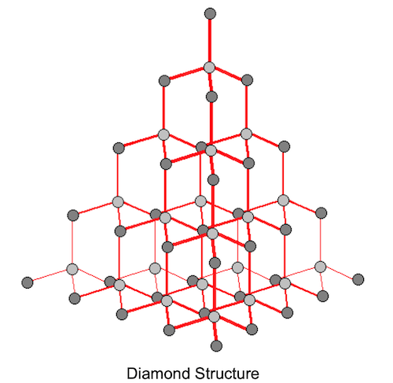
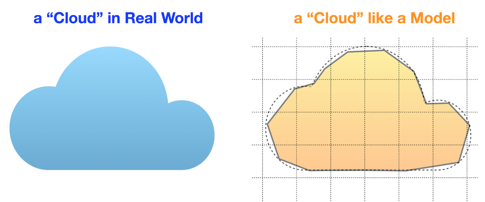
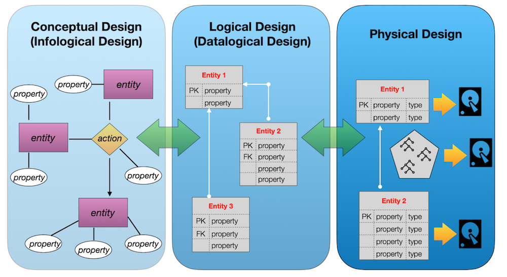

## _Let's improve customer experience_

В этом проекте ты научишься реализовывать бизнес-требования, обеспечивать целостность данных через ограничения и индексы, оптимизировать производительность БД, работать с последовательностями и массовыми операциями, а также документировать структуру базы — навыки необходимые, если ты backend-разработчик, дата-инженер или аналитик и работаешь с production-средами и системами лояльности в реальных компаниях.

💡 [Нажми сюда](https://new.oprosso.net/p/4cb31ec3f47a4596bc758ea1861fb624), **чтобы поделиться с нами обратной связью на этот проект**. Это анонимно и поможет нашей команде сделать обучение лучше. Рекомендуем заполнить опрос сразу после выполнения проекта.

## Содержание

- [Как учиться в «Школе 21»](#как-учиться-в-школе-21)
- [Chapter I](#chapter-i)
- [Введение](#введение)
- [Chapter II](#chapter-ii)
- [Рекомендации к выполнению этого проекта](#рекомендации-к-выполнению-этого-проекта)
- [Chapter III](#chapter-iii)
- [Задание 00 — Discounts, discounts, everyone loves discounts](#задание-00-discounts-discounts-everyone-loves-discounts)
- [Задание 01 — Let's set personal discounts](#задание-01-lets-set-personal-discounts)
- [Задание 02 — Let's recalculate a history of orders](#задание-02-lets-recalculate-a-history-of-orders)
- [Задание 03 — Improvements are in a way](#задание-03-improvements-are-in-a-way)
- [Задание 04 — We need more Data Consistency](#задание-04-we-need-more-data-consistency)
- [Задание 05 — Data Governance Rules](#задание-05-data-governance-rules)
- [Задание 06 — Let's automate Primary Key generation](#задание-06-lets-automate-primary-key-generation)

## Как учиться в «Школе 21»

- Здесь тебя ждет уникальный образовательный опыт с большим количеством свободы. Ты получаешь задачу и самостоятельно ищешь пути решения, используя любые удобные способы поиска информации — ресурсы Интернета или нейросети (например, GigaChat). Но внимательно относись к качеству информации: проверяй, думай, анализируй, сравнивай.
- Взаимообучение (Peer-to-Peer, P2P) — это обмен знаниями и опытом с другими пирами, где каждый выступает и учителем, и учеником. Такой подход позволяет глубже понять материал, учась друг у друга.
- Чувствуй себя свободно и проси о помощи — вокруг тебя те, кто тоже впервые проходят этот путь. Делись своим опытом и идеями с другими. Присоединяйся к Rocket.Chat, чтобы быть в курсе всех новостей от нашего сообщества.
- Твое обучение не будет иметь никакого смысла, если ты будешь копировать чужие решения. Если пользуешься помощью других — всегда разбирайся до конца, почему, как и зачем. Не бойся ошибиться.
- Кажется, что задача невыполнима? Сделай перерыв, проветрись, перезагрузи голову — это помогало многим. Возможно, после этого решение придет само собой.
- Важен не только результат обучения, но и сам процесс. Нужно не просто решить задачу, а понять, КАК ее решить.

Как работать с проектом:

- Перед выполнением проект необходимо склонировать с GitLab в одноименный репозиторий.
- Все файлы необходимо создавать в папке _src/_ склонированного репозитория.
- После клонирования проекта необходимо создать ветку _develop_ и вести разработку в ней. После этого пушить в GitLab также нужно ветку _develop_.
- В твоей директории не должно быть иных файлов, кроме тех, что обозначены в заданиях.

## Chapter I
## Введение

Почему алмаз является одним из самых прочных материалов? Причина кроется в его структуре. Каждый атом занимает строго определенное место в топологии кристаллической решётки алмаза, что делает весь кристалл практически неуязвимым.

Логическая структура БД подобна алмазу. Найти подходящую структуру для модели базы данных - значит найти золотую жилу (или алмаз :-). Моделирование баз данных включает два аспекта. Первый — это логическое представление, то есть то, насколько модель будет точно описывать реальные бизнес-процессы.

Второй аспект - модель должна решать функциональные задачи с минимальными затратами.

Это подразумевает преобразование логической модели в физическую, причем не только на уровне описания таблиц и атрибутов, но и — что сегодня гораздо важнее — с точки зрения производительности и бюджета.

Как же найти баланс?

Для этого существует 3 шага к созданию превосходного проекта.

Посмотри на картинку ниже.

## Chapter II
## Рекомендации к выполнению этого проекта

- Убедись, что ты работаешь с последней версией PostgreSQL.
- Ты можешь писать код (SQL-скрипты) в любой удобной IDE - это совершенно нормально.
- В директории должны оставаться только файлы, явно указанные в задании. Настрой .gitignore, чтобы избежать случайных ошибок
- Убедись, что у тебя есть личная база данных и доступ к ней в твоем кластере PostgreSQL.
- Скачай [скрипт](materials/model.sql) из папки Materials с моделью базы данных и примени его к своей базе - сделать это можно либо через командную строку с помощью psql, либо через любую удобную IDE, например DataGrip от JetBrains или pgAdmin из сообщества PostgreSQL. **Процесс обучения является инкрементным и линейным, поэтому убедись, что все изменения, которые были внесены в проект SQLB4_DML (Day 03) в ходе Заданий 07-13, и в проект SQLB5_Snapshots (Day 04) Задание 07, должны сохраняться (это похоже на реальную ситуацию, когда после выпуска релиза требуется обеспечить согласованность данных для новых изменений).**
- В каждом задании внимательно ознакомься с разделами «Разрешено» и «Запрещено» - там перечислены допустимые опции базы данных, типы, конструкции SQL и другие важные ограничения.
- Да прибудет с тобой сила SQL
- Приступай к работе - и пусть это будет увлекательно!

Перед выполнением заданий изучи логическую структуру модели базы данных ниже.

1. **Таблица pizzeria** (справочник пиццерий)
- поле id — первичный ключ
- поле name — название пиццерии
- поле rating — средний рейтинг пиццерии (от 0 до 5 баллов)
2. **Таблица person** (справочник клиентов, любящих пиццу)
- поле id — первичный ключ
- поле name — имя человека
- поле age — возраст человека
- поле gender — пол человека
- поле address — адрес человека
3. **Таблица menu** (справочник с доступным меню и ценами на конкретные пиццы)
- поле id — первичный ключ
- поле pizzeria_id — внешний ключ на таблицу pizzeria
- поле pizza_name — название пиццы в пиццерии
- поле price — цена конкретной пиццы
4. **Таблица person_visits** (журнал посещений пиццерий)
- поле id — первичный ключ
- поле person_id — внешний ключ на таблицу person
- поле pizzeria_id — внешний ключ на таблицу pizzeria
- поле visit_date — дата посещения (например, 2022-01-01)
5. **Таблица person_order** (журнал заказов)
- поле id — первичный ключ
- поле person_id — внешний ключ на таблицу person
- поле menu_id — внешний ключ на таблицу menu
- поле order_date — дата заказа (например, 2022-01-01)

Посещения пиццерий и заказы - это разные сущности, между которыми нет прямой зависимости в данных. Например, клиент может находиться в одном ресторане, просто просматривая меню, и одновременно сделать заказ в другом ресторане по телефону или через мобильное приложение. Или другой вариант - быть дома и оформить заказ по телефону, не посещая заведение вовсе.

## Chapter III
## Задание 00 — Discounts, discounts, everyone loves discounts

| Задание 00: Discounts, discounts, everyone loves discounts | |
|---------------------------------------|--------------------------------------------------------------------------------------------------------------------------|
| Директория для загрузки решений | ex00 |
| Файлы для загрузки | `day06_ex00.sql` |
| **Разрешено** | |
| Язык | SQL, DML, DDL |

Тебе нужно добавить новую бизнес-возможность в модель данных. Каждый клиент хочет видеть персональную скидку, а каждый бизнес стремится быть ближе к своим покупателям.

Представь систему персональных скидок для клиентов с одной стороны и пиццерий — с другой. Тебе нужно создать новую таблицу отношений (задай ей имя person_discounts) со следующими правилами:

- Определи атрибут id в качестве Primary Key (посмотри на столбец id в существующих таблицах и выбери тот же тип данных).
- Определи атрибуты person_id и pizzeria_id как Foreign Keys для соответствующих таблиц (типы данных должны совпадать с типами столбцов id в соответствующих родительских таблицах).
- Задай явные имена для ограничений внешнего ключа, используя шаблон fk_{table_name}_{column_name}, например, fk_person_discounts_person_id.
- Добавь атрибут discount для хранения значения скидки в процентах. Учти, что значение скидки может быть числом с плавающей запятой (используй тип данных numeric). Поэтому выбери соответствующий тип данных, чтобы учесть эту возможность.

## Задание 01 — Let's set personal discounts

| Задание 01: Let's set personal discounts | |
| ----- | ----- |
| Директория для загрузки решений | ex01 |
| Файлы для загрузки | `day06_ex01.sql` |
| **Разрешено** | |
| Язык | SQL, DML, DDL |

Итак, у тебя есть структура для хранения скидок и можно двигаться дальше — заполнить таблицу person_discounts новыми записями.

Перед тобой таблица person_order, в которой хранится история заказов клиентов. Тебе нужно написать DML-оператор (INSERT INTO ... SELECT ...), который заполнит таблицу person_discounts новыми записями, следуя приведенным правилам:

- Сгруппируй данные по столбцам person_id и pizzeria_id.
- Рассчитай размер персональной скидки по следующему псевдокоду:
  - Если количество заказов = 1, то скидка = 10.5
  - Иначе если количество заказов = 2, то скидка = 22
  - Иначе скидка = 30
- Чтобы создать первичный ключ для таблицы person_discounts, используй следующую SQL-конструкцию (эта конструкция относится к разделу SQL о оконных функциях):
  ROW_NUMBER() OVER () AS id

## Задание 02 — Let's recalculate a history of orders

| Задание 02: Let's recalculate a history of orders | |
| ----- | ----- |
| Директория для загрузки решений | ex02 |
| Файлы для загрузки | `day06_ex02.sql` |
| **Разрешено** | |
| Язык | SQL, DML, DDL |

Напиши SQL-запрос, который возвращает список заказов с фактической стоимостью и стоимостью с примененной скидкой для каждого клиента в соответствующей пиццерии. Отсортируй результаты по имени клиента и названию пиццы.

Пример вывода данных приведен ниже.

| name | pizza_name | price | discount_price | pizzeria_name |
|------|------------|-------|----------------|---------------|
| Andrey | cheese pizza | 800 | 624 | Dominos |
| Andrey | mushroom pizza | 1100 | 858 | Dominos |
| ... | ... | ... | ... | ... |

## Задание 03 — Improvements are in a way

| Задание 03: Improvements are in a way | |
| ----- | ----- |
| Директория для загрузки решений | ex03 |
| Файлы для загрузки | `day06_ex03.sql` |
| **Разрешено** | |
| Язык | SQL, DML, DDL |

Тебе необходимо обеспечить улучшение согласованности данных с одной стороны и повышение производительности — с другой.

Создай уникальный многоколоночный индекс (с именем idx_person_discounts_unique), который предотвратит дублирование пар идентификаторов person_id и pizzeria_id.

После создания нового индекса, предоставь любое простое SQL-выражение, которое демонстрирует использование индекса (с помощью EXPLAIN ANALYZE). Пример подтверждения приведён ниже:

    ...
    Index Scan using idx_person_discounts_unique on person_discounts
    ...

## Задание 04 — We need more Data Consistency

| Задание 04: We need more Data Consistency | |
| ----- | ----- |
| Директория для загрузки решений | ex04 |
| Файлы для загрузки | `day06_ex04.sql` |
| **Разрешено** | |
| Язык | SQL, DML, DDL |

Добавь следующие правила ограничений (constraints) для существующих столбцов таблицы person_discounts:

1. Столбец person_id не должен содержать NULL (используй имя ограничения ch_nn_person_id).
2. Столбец pizzeria_id не должен содержать NULL (используй имя ограничения ch_nn_pizzeria_id).
3. Столбец discount не должен содержать NULL (используй имя ограничения ch_nn_discount).
4. Столбец discount должен иметь значение по умолчанию 0 (0%).
5. Столбец discount должен содержать значения в диапазоне от 0 до 100 (используй имя ограничения ch_range_discount).

## Задание 05 — Data Governance Rules

| Задание 05: Data Governance Rules | |
| ----- | ----- |
| Директория для загрузки решений | ex05 |
| Файлы для загрузки | `day06_ex05.sql` |
| **Разрешено** | |
| Язык | SQL, DML, DDL |

В соответствии с политикой управления данными (Data Governance Policies), необходимо добавить комментарии к таблице и ее столбцам.

Примени это требование к таблице person_discounts. Добавь комментарии на английском или русском языке (на твое усмотрение), объясняющие бизнес-назначение таблицы и всех ее атрибутов.

## Задание 06 — Let's automate Primary Key generation

| Задание 06: Let's automate Primary Key generation | |
| ----- | ----- |
| Директория для загрузки решений | ex06 |
| Файлы для загрузки | `day06_ex06.sql` |
| **Разрешено** | |
| Язык | SQL, DML, DDL |
| **Запрещено** | |
| Шаблон SQL-синтаксиса | Не используй жёстко заданные значения (hard-coded) для количества строк, чтобы установить правильное значение для последовательности. |

Необходимо создать последовательность базы данных с именем seq_person_discounts (начиная со значения 1) и установить значение по умолчанию для атрибута id таблицы person_discounts, чтобы оно автоматически бралось из seq_person_discounts при каждой вставке.

Обрати внимание: следующее значение последовательности должно быть равно 1. В этом случае тебе нужно установить актуальное значение для последовательности на основе формулы: "количество строк в таблице person_discounts" + 1. В противном случае ты получишь ошибки нарушения ограничения первичного ключа (Primary Key violation constraint).