## _Isolation is one of ACID properties_

В этом проекте ты на практике изучишь работу транзакций и уровней изоляции в PostgreSQL: воспроизведешь классические аномалии данных (Lost Update, Dirty Reads и др.), проанализируешь механизм взаимоблокировок (deadlock) и научишься управлять согласованностью данных в параллельных процессах.

Эти навыки критически важны для проектирования высоконагруженных приложений, где требуется гарантировать целостность данных при одновременном доступе — например, в финансовых системах, платформах бронирования или инвентаризации.

💡 [Нажми сюда](https://new.oprosso.net/p/4cb31ec3f47a4596bc758ea1861fb624), **чтобы поделиться с нами обратной связью на этот проект**. Это анонимно и поможет нашей команде сделать обучение лучше. Рекомендуем заполнить опрос сразу после выполнения проекта.

## Содержание

- [Как учиться в «Школе 21»](#как-учиться-в-школе-21)
- [Chapter I](#chapter-i)
- [Введение](#введение)
- [Chapter II](#chapter-ii)
- [Рекомендации к выполнению этого проекта](#рекомендации-к-выполнению-этого-проекта)
- [Chapter III](#chapter-iii)
- [Задание 00 — Simple transaction](#задание-00-simple-transaction)
- [Задание 01 — Lost Update Anomaly](#задание-01-lost-update-anomaly)
- [Задание 02 — Lost Update for Repeatable Read](#задание-02-lost-update-for-repeatable-read)
- [Задание 03 — Non-Repeatable Reads Anomaly](#задание-03-non-repeatable-reads-anomaly)
- [Задание 04 — Non-Repeatable Reads for Serialization](#задание-04-non-repeatable-reads-for-serialization)
- [Задание 05 — Phantom Reads Anomaly](#задание-05-phantom-reads-anomaly)
- [Задание 06 — Phantom Reads for Repeatable Read](#задание-06-phantom-reads-for-repeatable-read)
- [Задание 07 — Deadlock](#задание-07-deadlock)

## Как учиться в «Школе 21»

- Здесь тебя ждет уникальный образовательный опыт с большим количеством свободы. Ты получаешь задачу и самостоятельно ищешь пути решения, используя любые удобные способы поиска информации — ресурсы Интернета или нейросети (например, GigaChat). Но внимательно относись к качеству информации: проверяй, думай, анализируй, сравнивай.
- Взаимообучение (Peer-to-Peer, P2P) — это обмен знаниями и опытом с другими пирами, где каждый выступает и учителем, и учеником. Такой подход позволяет глубже понять материал, учась друг у друга.
- Чувствуй себя свободно и проси о помощи — вокруг тебя те, кто тоже впервые проходят этот путь. Делись своим опытом и идеями с другими. Присоединяйся к Rocket.Chat, чтобы быть в курсе всех новостей от нашего сообщества.
- Твое обучение не будет иметь никакого смысла, если ты будешь копировать чужие решения. Если пользуешься помощью других — всегда разбирайся до конца, почему, как и зачем. Не бойся ошибиться.
- Кажется, что задача невыполнима? Сделай перерыв, проветрись, перезагрузи голову — это помогало многим. Возможно, после этого решение придет само собой.
- Важен не только результат обучения, но и сам процесс. Нужно не просто решить задачу, а понять, КАК ее решить.

Как работать с проектом:

- Перед выполнением проект необходимо склонировать с GitLab в одноименный репозиторий.
- Все файлы необходимо создавать в папке _src/_ склонированного репозитория.
- После клонирования проекта необходимо создать ветку _develop_ и вести разработку в ней. После этого пушить в GitLab также нужно ветку _develop_.
- В твоей директории не должно быть иных файлов, кроме тех, что обозначены в заданиях.

## Chapter I
## Введение

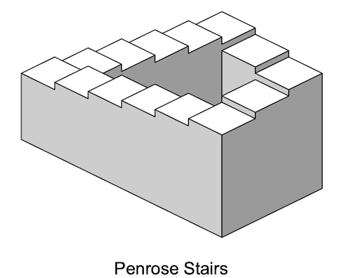

Лестница Пенроуза (англ. Penrose stairs или Penrose steps), также известная как «невозможная лестница», — это невозможный объект, созданный Лайонелом Пенроузом и его сыном Роджером Пенроузом. Будучи вариацией треугольника Пенроуза, она представляет собой двумерное изображение лестницы, ступени которой совершают четыре поворота на 90 градусов при подъеме или спуске, но при этом образуют непрерывную петлю. Таким образом, человек мог бы подниматься по ней вечно, но так и не оказаться выше. В трехмерном пространстве такое, очевидно, невозможно.

«Непрерывная лестница» была впервые представлена в статье Пенроузов в 1959 году, основанной на так называемом «треугольнике Пенроуза», который Роджер Пенроуз опубликовал в British Journal of Psychology в 1958 году.

«Лестница Пенроуза» — это математическая аномалия. В контексте теории баз данных также существует 4 фундаментальные аномалии данных (физические аномалии):

- Аномалия потери (Lost Update Anomaly);
- Аномалия «грязного» чтения (Dirty Reads Anomaly);
- Аномалия неповторяющегося чтения (Non-repeatable Reads Anomaly);
- Аномалия фантомного чтения (Phantom Read Anomaly).

Для борьбы с этими известными аномалиями в стандарте ANSI SQL предусмотрены различные уровни изоляции транзакций.

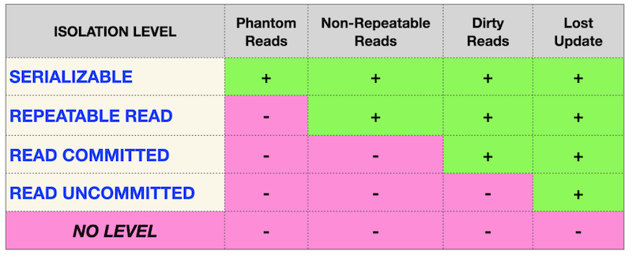

Если смотреть идеалистически, эта матрица должна бы быть стандартом для любой реляционной базы данных. Однако на практике... всё выглядит несколько иначе.

| PostgreSQL | 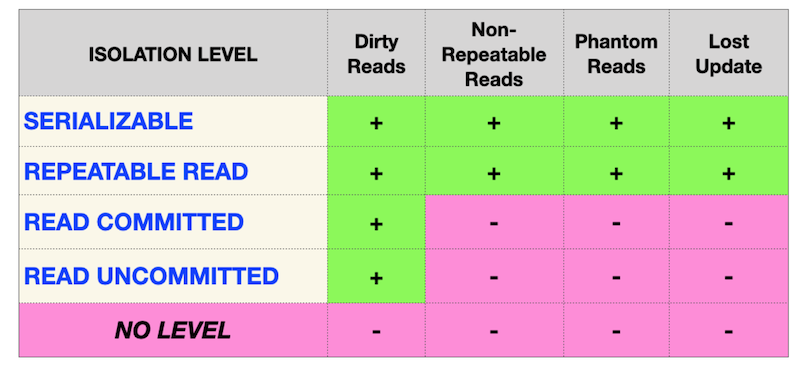 |
| Oracle | 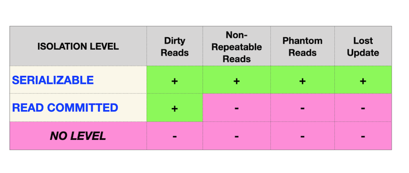 |
| MySQL | 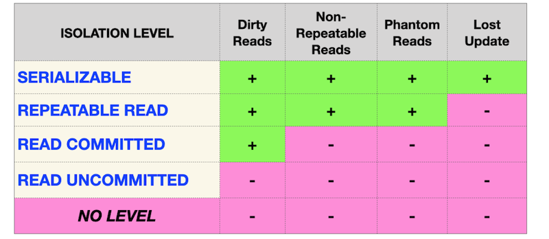 |

В настоящее время IT-сообщество выявило ряд новых аномалий, основанных на модели данных (логическом представлении):

- Аномалия перекоса чтения (Read Skew Anomaly);
- Аномалия перекоса записи (Write Skew Anomaly);
- Аномалия сериализации (Serialization Anomaly);
- Аномалия ловушки веера (Fan Traps Anomaly);
- Аномалия ловушки пропасти (Chasm Traps Anomaly);
- Аномалия циклических связей (Data Model Loops Anomaly);
- и другие.

## Chapter II
## Рекомендации к выполнению этого проекта

- Убедись, что ты работаешь с последней версией PostgreSQL.
- Ты можешь писать код (SQL-скрипты) в любой удобной IDE - это совершенно нормально.
- В директории должны оставаться только файлы, явно указанные в задании. Настрой .gitignore, чтобы избежать случайных ошибок
- Убедись, что у тебя есть личная база данных и доступ к ней в твоем кластере PostgreSQL.
- Скачай скрипт из папки Materials с моделью базы данных и примени его к своей базе - сделать это можно либо через командную строку с помощью psql, либо через любую удобную IDE, например DataGrip от JetBrains или pgAdmin из сообщества PostgreSQL. **Процесс обучения является инкрементным и линейным, поэтому убедись, что все изменения, которые были внесены в проект SQLB4_DML (Day 03) в ходе Заданий 07-13, и в проект SQLB5_Snapshots (Day 04) Задание 07, должны сохраняться (это похоже на реальную ситуацию, когда после выпуска релиза требуется обеспечить согласованность данных для новых изменений).**
- В каждом задании внимательно ознакомься с разделами «Разрешено» и «Запрещено» - там перечислены допустимые опции базы данных, типы, конструкции SQL и другие важные ограничения.
- Да прибудет с тобой сила SQL
- Приступай к работе - и пусть это будет увлекательно!

Перед выполнением заданий изучи логическую структуру модели базы данных ниже.

1. Таблица **pizzeria** (справочник пиццерий)
    - поле id — первичный ключ
    - поле name — название пиццерии
    - поле rating — средний рейтинг пиццерии (от 0 до 5 баллов)
2. Таблица **person** (справочник клиентов, любящих пиццу)
    - поле id — первичный ключ
    - поле name — имя человека
    - поле age — возраст человека
    - поле gender — пол человека
    - поле address — адрес человека
3. Таблица **menu** (справочник с доступным меню и ценами на конкретные пиццы)
    - поле id — первичный ключ
    - поле pizzeria_id — внешний ключ на таблицу pizzeria
    - поле pizza_name — название пиццы в пиццерии
    - поле price — цена конкретной пиццы
4. Таблица **person_visits** (журнал посещений пиццерий)
    - поле id — первичный ключ
    - поле person_id — внешний ключ на таблицу person
    - поле pizzeria_id — внешний ключ на таблицу pizzeria
    - поле visit_date — дата посещения (например, 2022-01-01)
5. Таблица **person_order** (журнал заказов)
    - поле id — первичный ключ
    - поле person_id — внешний ключ на таблицу person
    - поле menu_id — внешний ключ на таблицу menu
    - поле order_date — дата заказа (например, 2022-01-01)

Посещения пиццерий и заказы - это разные сущности, между которыми нет прямой зависимости в данных. Например, клиент может находиться в одном ресторане, просто просматривая меню, и одновременно сделать заказ в другом ресторане по телефону или через мобильное приложение. Или другой вариант - быть дома и оформить заказ по телефону, не посещая заведение вовсе.

## Chapter III
## Задание 00 — Simple transaction

| Задание 00: Simple transaction | |
| ----- | ----- |
| Директория для загрузки решений | ex00 |
| Файлы для загрузки | `day08_ex00.sql` с комментариями к командам, выполненным в Session #1, Session #2; скриншот вывода psql для Session #1; скриншот вывода psql для Session #2 |
| **Разрешено** | |
| Язык | SQL |

Для выполнения этой задачи используй командную строку СУБД PostgreSQL (psql). Тебе необходимо проверить, каким образом твои изменения становятся видны в базе данных другим пользователям.

Фактически, нам потребуется два активных сеанса (то есть два параллельных сеанса в командной строке).

Пожалуйста, предоставь доказательство того, что твой параллельный сеанс не видит эти изменения до тех пор, пока ты не выполнишь оператор COMMIT.

Смотри инструкции ниже.

**Session #1**

- Обнови рейтинг для "Pizza Hut" до 5 баллов в режиме транзакции.
- Проверь, что ты видишь эти изменения в сеансе №1.

**Session #2**

- Проверь, что ты *не* видишь этих изменений в session #2.

**Session #1**

- Опубликуй свои изменения для всех параллельных сеансов (сделай COMMIT).

**Session #2**

- Проверь, что теперь ты видишь эти изменения в Session #2

Таким образом, ознакомься с примером вывода для Session #2

    pizza_db=> select * from pizzeria where name  = 'Pizza Hut';
    id |   name    | rating
    ----+-----------+--------
    1 | Pizza Hut |    4.6
    (1 row)

    pizza_db=> select * from pizzeria where name  = 'Pizza Hut';
    id |   name    | rating
    ----+-----------+--------
    1 | Pizza Hut |      5
    (1 row)

Как видишь, один и тот же запрос возвращает разные результаты, поскольку первый запрос был выполнен до фиксации изменений в  Session#1, а второй — после его завершения.

## Задание 01 — Lost Update Anomaly

| Задание 01: Lost Update Anomaly | |
| ----- | ----- |
| Директория для загрузки решений | ex01 |
| Файлы для загрузки | `day08_ex01.sql` с комментариями к командам, выполненным в Session #1, Session #2; скриншот вывода psql для Session #1; скриншот вывода psql для Session #2 |
| **Разрешено** | |
| Язык | SQL |

Для выполнения этой задачи используй командную строку СУБД PostgreSQL (psql). Тебе нужно проверить, как твои изменения станут видны другим пользователям базы данных.

Фактически, тебе понадобятся два активных сеанса (то есть два параллельных сеанса в командной строке).

Перед выполнением задачи убедись, что в твоей базе данных установлен стандартный уровень изоляции. Для этого выполни следующую команду:  
`SHOW TRANSACTION ISOLATION LEVEL;`  
В результате должно быть выведено "read committed".

Если это не так, явно установи уровень изоляции read committed на уровне сеанса.

| |
|-|
| Изучи один из известных паттернов баз данных — "Аномалия потери обновления" (Lost Update Anomaly). Графическое представление этой аномалии ты можешь видеть на рисунке. Горизонтальная красная линия отображает конечный результат после выполнения всех последовательных шагов в обоих sessions. |
| 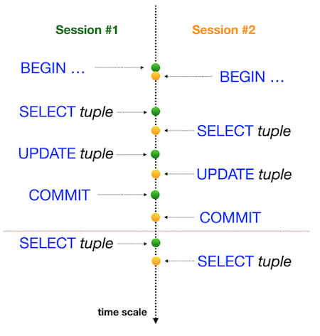 |

Проверь рейтинг для "Pizza Hut" в режиме транзакции в обоих сеансах, затем выполни ОБНОВЛЕНИЕ рейтинга до значения 4 в Session #1 и выполни ОБНОВЛЕНИЕ рейтинга до значения 3.6 в Session #2 (в той же последовательности, что и на изображении).

## Задание 02 — Lost Update for Repeatable Read

| Задание 02: Lost Update for Repeatable Read | |
| ----- | ----- |
| Директория для загрузки решений | ex02 |
| Файлы для загрузки | `day08_ex02.sql` с комментариями к командам, выполненным в Session #1, Session #2; скриншот вывода psql для Session #1; скриншот вывода psql для Session #2 |
| **Разрешено** | |
| Язык | SQL |

Для выполнения этой задачи используй командную строку СУБД PostgreSQL (psql). Тебе нужно проверить, как твои изменения станут видны в базе данных другим пользователям.

Фактически, нам потребуются два активных сеанса (sessions) (то есть два параллельных сеанса в командной строке).

| |
|-|
| Изучи один из известных паттернов баз данных — "Аномалию потери обновления" (Lost Update Anomaly), но на уровне изоляции REPEATABLE READ. Графическое представление этой аномалии ты можешь видеть на изображении. Горизонтальная красная линия показывает конечный результат после выполнения всех последовательных шагов в обоих сеансах. |
| 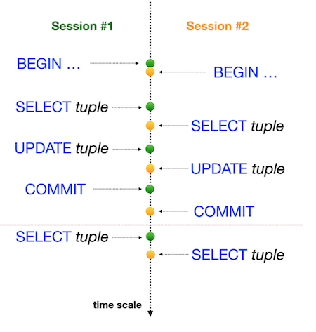 |

Проверь рейтинг для "Pizza Hut" в режиме транзакции в обоих сеансах, затем выполни ОБНОВЛЕНИЕ (UPDATE) рейтинга до значения 4 в Session #1 и выполни ОБНОВЛЕНИЕ (UPDATE) рейтинга до значения 3.6 в Session #2 (в той же последовательности, что и на рисунке).

## Задание 03 — Non-Repeatable Reads Anomaly

| Задание 03: Non-Repeatable Reads Anomaly | |
| ----- | ----- |
| Директория для загрузки решений | ex03 |
| Файлы для загрузки | `day08_ex03.sql` с комментариями к командам, выполненным в Session #1, Session #2; скриншот вывода psql для Session #1; скриншот вывода psql для Session #2 |
| **Разрешено** | |
| Язык | SQL |

Для выполнения этой задачи используй командную строку СУБД PostgreSQL (psql). Тебе нужно проверить, как твои изменения станут видны другим пользователям базы данных.

Фактически, тебе потребуются два активных сеанса (то есть два параллельных сеанса в командной строке).

| |
|-|
| Давай проверим один из известных паттернов баз данных — "Неповторяющееся чтение" (Non-Repeatable Reads), но на уровне изоляции READ COMMITTED. Графическое представление этой аномалии ты можешь видеть на рисунке. Горизонтальная красная линия отображает конечный результат после выполнения всех последовательных шагов в обоих сеансах (sessions). |
| 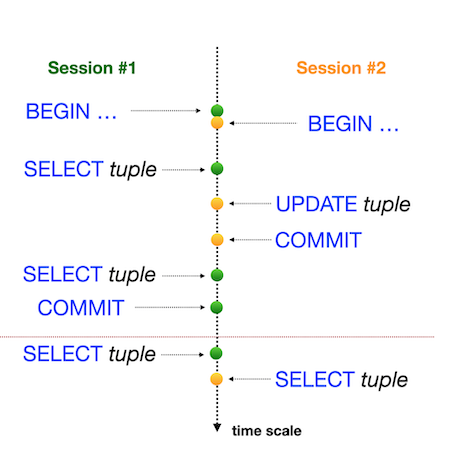 |

Проверь рейтинг для "Pizza Hut" в режиме транзакции в Session #1, а затем выполни ОБНОВЛЕНИЕ (UPDATE) рейтинга до значения 3.6 в Session #2 (в той же последовательности, что и на изображении).

## Задание 04 — Non-Repeatable Reads for Serialization

| Задание 04: Non-Repeatable Reads for Serialization | |
| ----- | ----- |
| Директория для загрузки решений | ex04 |
| Файлы для загрузки | `day08_ex04.sql` с комментариями к командам, выполненным в Session #1, Session #2; скриншот вывода psql для Session #1; скриншот вывода psql для Session #2 |
| **Разрешено** | |
| Язык | SQL |

Для выполнения этой задачи используй командную строку СУБД PostgreSQL (psql). Тебе нужно проверить, как твои изменения станут видны другим пользователям базы данных.

Фактически, тебе потребуются два активных сеанса (то есть два параллельных сеанса в командной строке).

| |
|-|
| Давай проверим один из известных паттернов баз данных — "Неповторяющееся чтение" (Non-Repeatable Reads), но на уровне изоляции SERIALIZABLE. Графическое представление этой аномалии ты можешь видеть на изображении. Горизонтальная красная линия показывает конечный результат после выполнения всех последовательных шагов в обоих сеансах. |
| 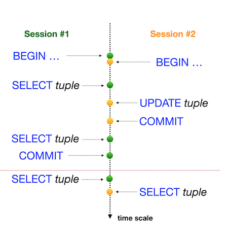 |

Проверь рейтинг для "Pizza Hut" в режиме транзакции в Session #1, а затем выполни ОБНОВЛЕНИЕ (UPDATE) рейтинга до значения 3.0 в Session #2 (в той же последовательности, что и на изображении).

## Задание 05 — Phantom Reads Anomaly

| Задание 05: Phantom Reads Anomaly | |
| ----- | ----- |
| Директория для загрузки решений | ex05 |
| Файлы для загрузки | `day08_ex05.sql` с комментариями к командам, выполненным в Session #1, Session #2; скриншот вывода psql для Session #1; скриншот вывода psql для Session #2 |
| **Разрешено** | |
| Язык | SQL |

Для выполнения этой задачи используй командную строку СУБД PostgreSQL (psql). Тебе нужно проверить, как твои изменения станут видны другим пользователям базы данных.

Фактически, тебе потребуются два активных сеанса (то есть два параллельных сеанса в командной строке).

| |
|-|
| Давай рассмотрим один из известных паттернов баз данных — "Фантомное чтение" (phantom reads), но на уровне изоляции READ COMMITTED. Графическое представление этой аномалии ты можешь видеть на изображении. Горизонтальная красная линия показывает конечный результат после выполнения всех последовательных шагов в обоих сеансах. |
|  |

Выполни суммирование всех рейтингов для всех пиццерий в режиме одной транзакции в Session #1, а затем выполни ВСТАВКУ (INSERT) нового ресторана 'Kazan Pizza' с рейтингом 5 и ID=10 в Session #2 (в той же последовательности, что и на рисунке).

## Задание 06 — Phantom Reads for Repeatable Read

| Задание 06: Phantom Reads for Repeatable Read | |
| ----- | ----- |
| Директория для загрузки решений | ex06 |
| Файлы для загрузки | `day08_ex06.sql` с комментариями к командам, выполненным в Session #1, Session #2; скриншот вывода psql для Session #1; скриншот вывода psql для Session #2 |
| **Разрешено** | |
| Язык | SQL |

Для выполнения этой задачи используй командную строку СУБД PostgreSQL (psql). Тебе нужно проверить, как твои изменения станут видны другим пользователям базы данных.

Фактически, тебе потребуются два активных сеанса (то есть два параллельных сеанса в командной строке).

| |
|-|
| Давай рассмотрим один из известных паттернов баз данных — "Фантомное чтение" (Phantom Reads), но на уровне изоляции REPEATABLE READ. Графическое представление этой аномалии ты можешь видеть на изображении. Горизонтальная красная линия показывает конечный результат после выполнения всех последовательных шагов в обоих сеансах. |
| 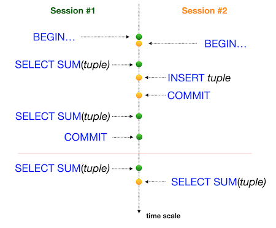 |

Выполни агрегацию всех рейтингов для всех пиццерий в режиме одной транзакции в Session #1, а затем выполни ВСТАВКУ (INSERT) нового ресторана 'Kazan Pizza 2' с рейтингом 4 и ID=11 в Session #2 (в той же последовательности, что и на рисунке).

## Задание 07 — Deadlock

| Задание 07: Deadlock | |
| ----- | ----- |
| Директория для загрузки решений | ex07 |
| Файлы для загрузки | `day08_ex07.sql` с комментариями к командам, выполненным в Session #1, Session #2; скриншот вывода psql для Session #1; скриншот вывода psql для Session #2 |
| **Разрешено** | |
| Язык | SQL |

Для выполнения этой задачи используй командную строку СУБД PostgreSQL (psql). Тебе нужно проверить, как твои изменения станут видны другим пользователям базы данных.

Фактически, тебе потребуются два активных сеанса (то есть два параллельных сеанса в командной строке).

Давай воспроизведем ситуацию взаимоблокировки (deadlock) в базе данных.

| |
|-|
| Графическое представление ситуации взаимоблокировки (deadlock) представлено на изображении. Она выглядит как "перекрёстная блокировка" (Christ-lock) между параллельными сеансами. |
| 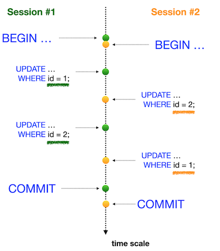 |

Напиши любой SQL-запрос с любым уровнем изоляции (можно использовать настройки по умолчанию) для таблицы pizzeria, чтобы воспроизвести ситуацию взаимоблокировки (deadlock).