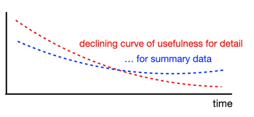
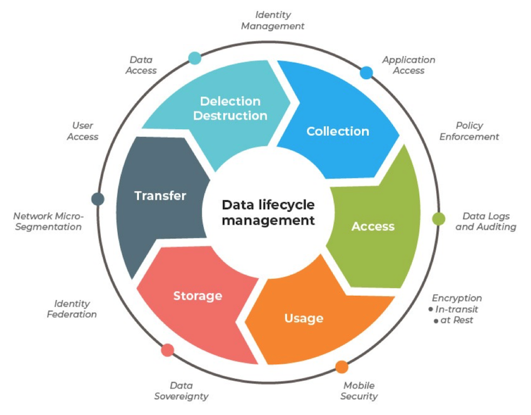
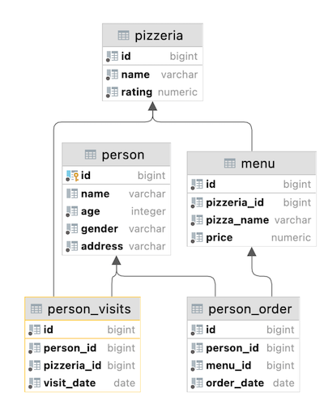

## _Aggregated data is more informative, isn't it?_

В этом проекте ты освоишь ключевые практические навыки SQL-анализа, необходимые для решения реальных бизнес-задач: агрегацию данных (расчет сумм, средних, минимума/максимума), группировку по атрибутам, фильтрацию результатов, соединение таблиц и работу с условиями.

Ты научишься превращать сырые данные из базы в структурированные отчеты, рассчитывать метрики эффективности, анализировать поведение клиентов и принимать обоснованные бизнес-решения на основе данных.

💡 [Нажми сюда](https://new.oprosso.net/p/4cb31ec3f47a4596bc758ea1861fb624), **чтобы поделиться с нами обратной связью на этот проект**. Это анонимно и поможет нашей команде сделать обучение лучше. Рекомендуем заполнить опрос сразу после выполнения проекта.

## Содержание

- [Как учиться в «Школе 21»](#как-учиться-в-школе-21)
- [Chapter I](#chapter-i)
- [Введение](#введение)
- [Chapter II](#chapter-ii)
- [Рекомендации к выполнению этого проекта](#рекомендации-к-выполнению-этого-проекта)
- [Chapter III](#chapter-iii)
- [Задание 00 — Simple aggregated information](#задание-00-simple-aggregated-information)
- [Задание 01 — Let's see real names](#задание-01-lets-see-real-names)
- [Задание 02 — Restaurants statistics](#задание-02-restaurants-statistics)
- [Задание 03 — Restaurants statistics #2](#задание-03-restaurants-statistics-2)
- [Задание 04 — Clause for groups](#задание-04-clause-for-groups)
- [Задание 05 — Person's uniqueness](#задание-05-persons-uniqueness)
- [Задание 06 — Restaurant metrics](#задание-06-restaurant-metrics)
- [Задание 07 — Average global rating](#задание-07-average-global-rating)
- [Задание 08 — Find pizzeria's restaurant locations](#задание-08-find-pizzerias-restaurant-locations)
- [Задание 09 — Explicit type transformation](#задание-09-explicit-type-transformation)

## Как учиться в «Школе 21»

- Здесь тебя ждет уникальный образовательный опыт с большим количеством свободы. Ты получаешь задачу и самостоятельно ищешь пути решения, используя любые удобные способы поиска информации — ресурсы Интернета или нейросети (например, GigaChat). Но внимательно относись к качеству информации: проверяй, думай, анализируй, сравнивай.
- Взаимообучение (Peer-to-Peer, P2P) — это обмен знаниями и опытом с другими пирами, где каждый выступает и учителем, и учеником. Такой подход позволяет глубже понять материал, учась друг у друга.
- Чувствуй себя свободно и проси о помощи — вокруг тебя те, кто тоже впервые проходят этот путь. Делись своим опытом и идеями с другими. Присоединяйся к Rocket.Chat, чтобы быть в курсе всех новостей от нашего сообщества.
- Твое обучение не будет иметь никакого смысла, если ты будешь копировать чужие решения. Если пользуешься помощью других — всегда разбирайся до конца, почему, как и зачем. Не бойся ошибиться.
- Кажется, что задача невыполнима? Сделай перерыв, проветрись, перезагрузи голову — это помогало многим. Возможно, после этого решение придет само собой.
- Важен не только результат обучения, но и сам процесс. Нужно не просто решить задачу, а понять, КАК ее решить.

Как работать с проектом:

- Перед выполнением проект необходимо склонировать с GitLab в одноименный репозиторий.
- Все файлы необходимо создавать в папке _src/_ склонированного репозитория.
- После клонирования проекта необходимо создать ветку _develop_ и вести разработку в ней. После этого пушить в GitLab также нужно ветку _develop_.
- В твоей директории не должно быть иных файлов, кроме тех, что обозначены в заданиях.

## Chapter I
## Введение

Для анализа детализированных данных в динамике обрати внимание на Кривую Полезности. Иными словами, детализированные данные (такие как транзакции пользователей, сведения о продуктах и поставщиках и т.д.) не представляют ценности с исторической точки зрения, поскольку для описания ситуации годичной давности необходимы лишь агрегированные показатели.

Почему так происходит? Причина кроется в особенностях аналитического мышления. По сути, твоя задача - сфокусироваться на исторической ретроспективе бизнес-стратегии для формирования новых целей, без необходимости погружаться в детали.

С точки зрения архитектуры баз данных, «Аналитическое мышление» соответствует OLAP-трафику (информационный уровень), а «детали» - OLTP-трафику (уровень сырых данных). Сегодня существует более гибкий подход для совместного хранения детализированных данных и агрегированной информации в экосистеме - концепция LakeHouse = DataLake + DataWareHouse.

Если говорить об исторических данных, следует упомянуть паттерн «Управление Жизненным Циклом Данных» (Data Lifecycle Management).

Проще говоря, что делать с устаревшими данными? TTL (время жизни), SLA для данных, Политика Хранения Данных - эти термины относятся к стратегии управления данными (Data Governance).

## Chapter II
## Рекомендации к выполнению этого проекта

- Убедись, что ты работаешь с последней версией PostgreSQL.
- Ты можешь писать код (SQL-скрипты) в любой удобной IDE - это совершенно нормально.
- В директории должны оставаться только файлы, явно указанные в задании. Настрой .gitignore, чтобы избежать случайных ошибок
- Убедись, что у тебя есть личная база данных и доступ к ней в твоем кластере PostgreSQL.
- Скачай [скрипт](materials/model.sql) из папки Materials с моделью базы данных и примени его к своей базе - сделать это можно либо через командную строку с помощью psql, либо через любую удобную IDE, например DataGrip от JetBrains или pgAdmin из сообщества PostgreSQL. **Процесс обучения является инкрементным и линейным, поэтому убедись, что все изменения, которые были внесены в проект SQLB4_DML (Day 03) в ходе Заданий 07-13, и в проект SQLB5_Snapshots (Day 04) Задание 07, должны сохраняться (это похоже на реальную ситуацию, когда после выпуска релиза требуется обеспечить согласованность данных для новых изменений).**
- В каждом задании внимательно ознакомься с разделами «Разрешено» и «Запрещено» - там перечислены допустимые опции базы данных, типы, конструкции SQL и другие важные ограничения.
- Да прибудет с тобой сила SQL
- Приступай к работе - и пусть это будет увлекательно!

Перед выполнением заданий изучи логическую структуру модели базы данных ниже.

1. Таблица **pizzeria** (справочник пиццерий)
- поле id — первичный ключ
- поле name — название пиццерии
- поле rating — средний рейтинг пиццерии (от 0 до 5 баллов)
2. Таблица **person** (справочник клиентов, любящих пиццу)
- поле id — первичный ключ
- поле name — имя человека
- поле age — возраст человека
- поле gender — пол человека
- поле address — адрес человека
3. Таблица **menu** (справочник с доступным меню и ценами на конкретные пиццы)
- поле id — первичный ключ
- поле pizzeria_id — внешний ключ на таблицу pizzeria
- поле pizza_name — название пиццы в пиццерии
- поле price — цена конкретной пиццы
4. Таблица **person_visits** (журнал посещений пиццерий)
- поле id — первичный ключ
- поле person_id — внешний ключ на таблицу person
- поле pizzeria_id — внешний ключ на таблицу pizzeria
- поле visit_date — дата посещения (например, 2022-01-01)
5. Таблица **person_order** (журнал заказов)
- поле id — первичный ключ
- поле person_id — внешний ключ на таблицу person
- поле menu_id — внешний ключ на таблицу menu
- поле order_date — дата заказа (например, 2022-01-01)

Посещения пиццерий и заказы - это разные сущности, между которыми нет прямой зависимости в данных. Например, клиент может находиться в одном ресторане, просто просматривая меню, и одновременно сделать заказ в другом ресторане по телефону или через мобильное приложение. Или другой вариант - быть дома и оформить заказ по телефону, не посещая заведение вовсе.

## Chapter III
## Задание 00 — Simple aggregated information

| Задание 00: Simple aggregated information | |
| ----- | ----- |
| Директория для загрузки решений | ex00 |
| Файлы для загрузки | `day07_ex00.sql` |
| **Разрешено** | |
| Язык | ANSI SQL |

Выполним простую агрегацию. Напиши SQL-запрос, который возвращает идентификаторы людей (person_id) и соответствующее количество посещений любых пиццерий.

Отсортируй результат по количеству посещений в порядке убывания (descending), а затем по идентификатору человека (person_id) в порядке возрастания (ascending).

Пример данных ниже

| person_id | count_of_visits |
| ----- | ----- |
| 9 | 4 |
| 4 | 3 |
| ... | ... |

## Задание 01 — Let's see real names

| Задание 01: Let's see real names | |
| ----- | ----- |
| Директория для загрузки решений | ex01 |
| Файлы для загрузки | `day07_ex01.sql` |
| **Разрешено** | |
| Язык | ANSI SQL |

Измени SQL-запрос из Задания 00 так, чтобы он возвращал имя человека (name), а не его идентификатор.

Дополнительное условие - нужно вывести только топ-4 человека с наибольшим количеством визитов во все пиццерии, отсортированных по имени человека. Ниже приведен пример результата.

| name | count_of_visits |
|------|-----------------|
| Dmitriy | 4 |
| Denis | 3 |
| ... | ... |

## Задание 02 — Restaurants statistics

| Задание 02: Restaurants statistics | |
| ----- | ----- |
| Директория для загрузки решений | ex02 |
| Файлы для загрузки | `day07_ex02.sql` |
| **Разрешено** | |
| Язык | ANSI SQL |

Напиши SQL-запрос, который выведет топ-3 заведения, которые являются самыми популярными по количеству посещений и по количеству заказов, объединив результаты в один список.

Добавь столбец action_type, который будет содержать значения 'order' (заказ) или 'visit' (посещение) в зависимости от того, из какой таблицы взяты данные.

Ознакомься с примером данных ниже.

Отсортируйте итоговый результат в порядке возрастания по столбцу action_type и в порядке убывания по столбцу с количеством (count).

| name | count | action_type |
|------|-------|-------------|
| Dominos | 6 | order |
| ... | ... | ... |
| Dominos | 7 | visit |
| ... | ... | ... |

## Задание 03 — Restaurants statistics #2

| Задание 03: Restaurants statistics #2 | |
| ----- | ----- |
| Директория для загрузки решений | ex03 |
| Файлы для загрузки | `day07_ex03.sql` |
| **Разрешено** | |
| Язык | ANSI SQL |

Напиши SQL-запрос, который покажет, как рестораны группируются по количеству посещений и по количеству заказов, а затем объединит эти данные по названию пиццерии.

Можно использовать внутренний запрос из Задания 02 (Restaurants by Visits and by Orders) без каких-либо ограничений на количество строк.

Добавь следующие правила:

- Вычисли общую сумму заказов и посещений для каждой пиццерии (учитывай, что не все пиццерии могут присутствовать в обеих таблицах).
- Отсортируй результаты по столбцу total_count (общее количество) в порядке убывания, а затем по столбцу name (название) в порядке возрастания.

Ознакомься с примером данных ниже.

| name | total_count |
|------|-------------|
| Dominos | 13 |
| DinoPizza | 9 |
| ... | ... |

## Задание 04 — Clause for groups

| Задание 04: Clause for groups | |
| ----- | ----- |
| Директория для загрузки решений | ex04 |
| Файлы для загрузки | `day07_ex04.sql` |
| **Разрешено** | |
| Язык | ANSI SQL |
| **Запрещено** | |
| Синтаксическая конструкция | WHERE |

Напиши SQL-запрос, который возвращает имя человека (person name) и соответствующее количество посещений любых пиццерий при условии, что это количество превышает 3 раза (> 3).

Ознакомься с примером данных ниже.

| name | count_of_visits |
|------|-----------------|
| Dmitriy | 4 |

## Задание 05 — Person's uniqueness

| Задание 05: Person's uniqueness | |
| ----- | ----- |
| Директория для загрузки решений | ex05 |
| Файлы для загрузки | `day07_ex05.sql` |
| **Разрешено** | |
| Язык | ANSI SQL |
| **Запрещено** | |
| Синтаксическая конструкция | GROUP BY, any type (UNION,...) working with sets |

Напиши простой SQL-запрос, который возвращает список уникальных имен людей, сделавших хотя бы один заказ в любой из пиццерий.

Отсортируй результат по имени человека.

Ознакомься с примером ниже.

| name |
|------|
| Andrey |
| Anna |
| ... |

## Задание 06 — Restaurant metrics

| Задание 06: Restaurant metrics | |
| ----- | ----- |
| Директория для загрузки решений | ex06 |
| Файлы для загрузки | `day07_ex06.sql` |
| **Разрешено** | |
| Язык | ANSI SQL |

Напиши SQL-запрос, который возвращает для каждой пиццерии:

- общее количество заказов,
- среднюю цену,
- максимальную цену
- и минимальную цену на проданные пиццы.

Результат должен быть отсортирован по названию пиццерии. Округли среднюю цену до двух знаков после запятой.

Ознакомься с примером данных ниже.

| name | count_of_orders | average_price | max_price | min_price |
|------|-----------------|---------------|-----------|-----------|
| Best Pizza | 5 | 780 | 850 | 700 |
| DinoPizza | 5 | 880 | 1000 | 800 |
| ... | ... | ... | ... | ... |

## Задание 07 — Average global rating

| Задание 07: Average global rating | |
| ----- | ----- |
| Директория для загрузки решений | ex07 |
| Файлы для загрузки | `day07_ex07.sql` |
| **Разрешено** | |
| Язык | ANSI SQL |

Напиши SQL-запрос, который возвращает общий средний рейтинг (выходной атрибут назови global_rating) для всех ресторанов.

Округли среднее значение рейтинга до 4 знаков после запятой.

## Задание 08 — Find pizzeria's restaurant locations

| Задание 08: Find pizzeria's restaurant locations | |
| ----- | ----- |
| Директория для загрузки решений | ex08 |
| Файлы для загрузки | `day07_ex08.sql` |
| **Разрешено** | |
| Язык | ANSI SQL |

Из данных известны личные адреса людей. Предположим, что человек посещает только пиццерии в своем городе.

Напиши SQL-запрос, который возвращает:

1. Адрес (person address)
2. Название пиццерии (pizzeria name)
3. Общее количество заказов (count of orders) в этой пиццерии.

Отсортируй результат сначала по адресу, а затем по названию заведения.

Ознакомься с примером выходных данных ниже.

| address | name | count_of_orders |
|---------|------|-----------------|
| Kazan | Best Pizza | 4 |
| Kazan | DinoPizza | 4 |
| ... | ... | ... |

## Задание 09 — Explicit type transformation

| Задание 09: Explicit type transformation | |
| ----- | ----- |
| Директория для загрузки решений | ex09 |
| Файлы для загрузки | `day07_ex09.sql` |
| **Разрешено** | |
| Язык | ANSI SQL |

Напиши SQL-запрос, который возвращает агрегированную информацию по адресу каждого человека.

В результат должны быть включены:

- вычисляемый столбец с формулой: «Максимальный возраст - (Минимальный возраст / Максимальный возраст)»,
- средний возраст по каждому адресу average age per address),
- результат сравнения формулы и среднего возраста (то есть, если значение формулы больше среднего возраста, то значение должно быть True, иначе - False).

Результат необходимо отсортировать по столбцу с адресом.

Ниже приведен пример ожидаемых данных.

| address | formula | average | comparison |
|---------|---------|---------|------------|
| Kazan | 44.71 | 30.33 | true |
| Moscow | 20.24 | 18.5 | true |
| ... | ... | ... | ... |