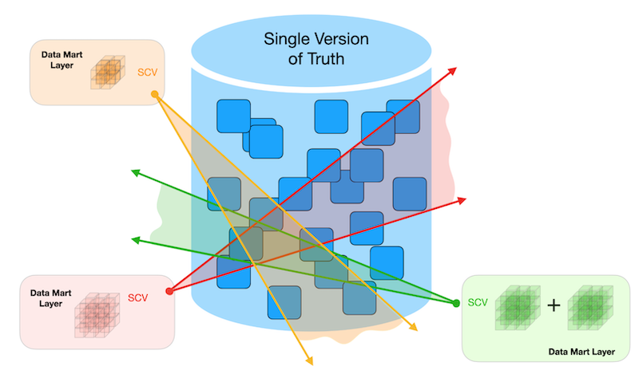
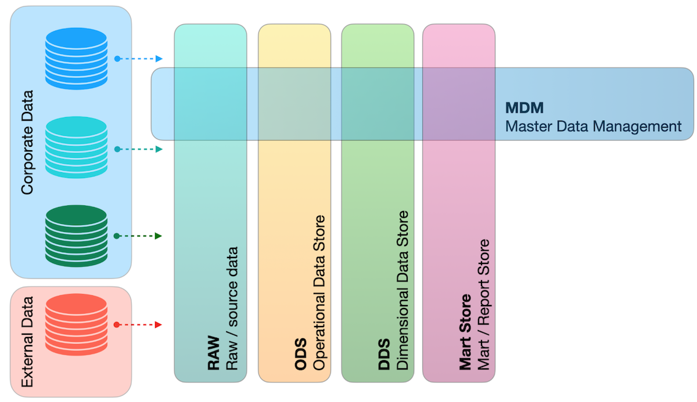
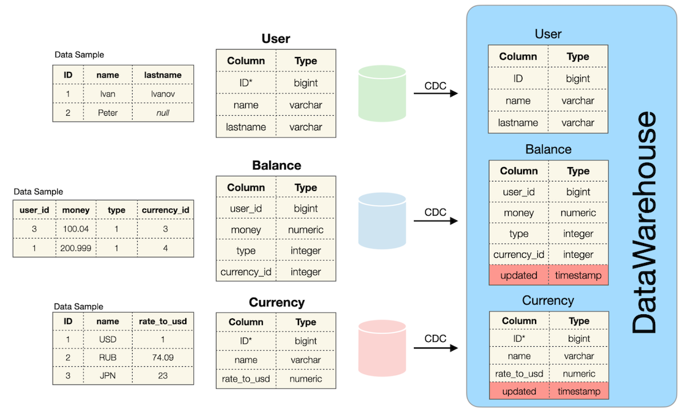
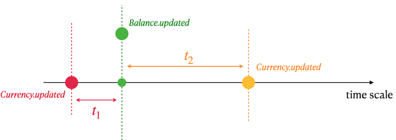

## _Data Warehouse_

В этом групповом проекте ты разберешься, как устроены хранилища данных (DWH), и пройдешь весь путь создания ETL-процесса.

Ты будешь создавать SQL-запросы, которые умеют обрабатывать «неидеальные» данные: искать пропущенные значения, связывать информацию из разных источников и корректно агрегировать показатели. Эти навыки помогут тебе в будущем браться за задачи по построению ETL-пайплайнов, анализу данных с историей изменений и подготовке данных для отчетности - то, что требуется практически в любой команде, работающей с данными.

💡 [Нажми сюда](https://new.oprosso.net/p/4cb31ec3f47a4596bc758ea1861fb624), **чтобы поделиться с нами обратной связью на этот проект**. Это анонимно и поможет нашей команде сделать обучение лучше. Рекомендуем заполнить опрос сразу после выполнения проекта.

## Содержание

- [Как учиться в «Школе 21»](#как-учиться-в-школе-21)
- [Chapter I](#chapter-i)
- [Введение](#введение)
- [Chapter II](#chapter-ii)
- [Рекомендации к выполнению этого проекта](#рекомендации-к-выполнению-этого-проекта)
- [Chapter III](#chapter-iii)
- [Задание 00 — Classical DWH](#задание-00-classical-dwh)
- [Задание 01 — Detailed Query](#задание-01-detailed-query)

## Как учиться в «Школе 21»

- Здесь тебя ждет уникальный образовательный опыт с большим количеством свободы. Ты получаешь задачу и самостоятельно ищешь пути решения, используя любые удобные способы поиска информации — ресурсы Интернета или нейросети (например, GigaChat). Но внимательно относись к качеству информации: проверяй, думай, анализируй, сравнивай.
- Взаимообучение (Peer-to-Peer, P2P) — это обмен знаниями и опытом с другими пирами, где каждый выступает и учителем, и учеником. Такой подход позволяет глубже понять материал, учась друг у друга.
- Чувствуй себя свободно и проси о помощи — вокруг тебя те, кто тоже впервые проходят этот путь. Делись своим опытом и идеями с другими. Присоединяйся к Rocket.Chat, чтобы быть в курсе всех новостей от нашего сообщества.
- Твое обучение не будет иметь никакого смысла, если ты будешь копировать чужие решения. Если пользуешься помощью других — всегда разбирайся до конца, почему, как и зачем. Не бойся ошибиться.
- Кажется, что задача невыполнима? Сделай перерыв, проветрись, перезагрузи голову — это помогало многим. Возможно, после этого решение придет само собой.
- Важен не только результат обучения, но и сам процесс. Нужно не просто решить задачу, а понять, КАК ее решить.

Как работать с проектом:

- Перед выполнением проект необходимо склонировать с GitLab в одноименный репозиторий.
- Все файлы необходимо создавать в папке _src/_ склонированного репозитория.
- После клонирования проекта необходимо создать ветку _develop_ и вести разработку в ней. После этого пушить в GitLab также нужно ветку _develop_.
- В твоей директории не должно быть иных файлов, кроме тех, что обозначены в заданиях.

## Chapter I
## Введение

Хранилище данных (DWH) - это процесс сбора и управления данными из различных источников для получения содержательной бизнес-аналитики. Хранилище данных обычно используется для объединения и анализа бизнес-данных из гетерогенных источников. Оно является ядром BI-системы, созданной для анализа данных и отчетности.

Есть 2 «отца-основателя» концепции хранилищ данных, которые придерживаются противоположных взглядов на то, как лучше всего выстраивать логические уровни данных в DWH.

| «Хранилище данных - это предметно-ориентированная, интегрированная, неизменяемая и изменяемая во времени коллекция данных, предназначенная для поддержки принятия управленческих решений». (Билл Инмон) |  |
|------|------|
|  | «Хранилище данных - это система, которая извлекает, очищает, унифицирует и загружает исходные данные в хранилище измерений (dimensional data store) с последующей поддержкой и реализацией механизмов запросов и анализа для принятия решений». (Ральф Кимбал) |

Сегодня объем Big Data («Больших данных») продолжает неуклонно расти, что требует все больше ресурсов для управления, структурирования и последующего анализа информации. Для поддержки классических систем Data WareHouse был предложен новый архитектурный подход под названием LakeHouse (основанный на λ-архитектуре), который представляет собой комбинацию DataLake и DataWareHouse.

С логической точки зрения современный LakeHouse можно представить как набор логических уровней данных.

Таким образом, чтобы стать Архитектором Данных, необходимо знать «несколько больше», чем просто реляционное моделирование.

Рассмотрим список существующих шаблонов моделей данных:

- Relational Model,
- Temporal Model,
- BiTemporal Model,
- USS Model,
- EAV Model,
- Star / Snowflake Models,
- Galaxy Model,
- Data Vault Model,
- Anchor Model,
- Graph Model.

## Chapter II
## Рекомендации к выполнению этого проекта

- Убедись, что у тебя есть личная база данных и доступ к ней в твоем кластере PostgreSQL.
- В каждом задании внимательно ознакомься с разделами «Разрешено» и «Запрещено» - там перечислены допустимые опции базы данных, типы, конструкции SQL и другие важные ограничения.
- Скачай [скрипт](materials/model.sql) из папки Materials с моделью базы данных и примени его к своей базе - сделать это можно либо через командную строку с помощью psql, либо через любую удобную IDE, например DataGrip от JetBrains или pgAdmin из сообщества PostgreSQL.
- Перед выполнением заданий изучи логическую структуру модели базы данных ниже.
- Да прибудет с тобой сила SQL
- Приступай к работе - и пусть это будет увлекательно!

## Chapter III
## Задание 00 — Classical DWH

| Задание 00: Classical DWH | |
| ----- | ----- |
| Директория для загрузки решений | ex00 |
| Файлы для загрузки | `team01_ex00.sql` |
| **Разрешено** | |
| Язык | SQL |

Изучи источники данных и первый логический уровень данных - ODS (Operational Data Store) в составе хранилища данных (DWH).

Определение таблицы **User** (в исходной базе данных-поставщике Green Source Database):

| Название столбца | Описание |
|---------|----------|
| ID | Первичный ключ |
| name | Имя пользователя |
| lastname | Фамилия пользователя |

Определение таблицы **Currency** (в сторонной базе данных-источнике Red Source Database):

| Название столбца | Описание |
|---------|----------|
| ID | Первичный ключ |
| name | Наименование валюты |
| rate_to_usd | Курс к доллару США |

Определение таблицы **Balance** (в внутренней/операционной базе данных-источнике Blue Source Database):

| Название столбца | Описание |
|---------|----------|
| user_id | "Виртуальный внешний ключ" к таблице User из внешнего источника |
| money | Сумма средств |
| type | Тип баланса (может принимать значения 0, 1, ...) |
| currency_id | "Виртуальный внешний ключ" к таблице Currency из внешнего источника |

Базы данных Green, Red и Blue являются независимыми источниками данных и соответствуют паттерну микросервисов. Это означает высокий риск аномалий данных (см. ниже).

- Таблицы не находятся в состоянии согласованности данных. Это выражается в том, что может существовать пользователь (User), но отсутствовать соответствующие записи в таблице Balance, или наоборот - существовать запись о балансе при отсутствии соответствующего пользователя. Аналогичная ситуация наблюдается между таблицами Currency и Balance. (Иными словами, между ними отсутствуют явные внешние ключи).
- Возможны значения NULL в полях Name и Lastname таблицы User.
- Все таблицы работают под нагрузкой OLTP-транзакций (OnLine Transactional Processing, обработка транзакций в реальном времени). Это означает, что в них хранится текущее состояние данных на каждый момент времени, а исторические изменения для каждой таблицы не сохраняются.

Эти три перечисленные таблицы являются источниками данных для таблиц со схожими моделями в области хранилища данных (DWH).

Определение таблицы **User** (в базе данных DWH):

| Название столбца | Описание |
|---------|----------|
| ID | Первичный ключ |
| name | Имя пользователя |
| lastname | Фамилия пользователя |

Определение таблицы **Currency** (в базе данных DWH):

| Название столбца | Описание |
|---------|----------|
| ID | Суррогатный первичный ключ |
| name | Наименование валюты |
| rate_to_usd | Курс к доллару США |
| updated | Отметка времени события из базы-источника |

*Суррогатный первичный ключ (Mocked Primary Key) означает, что допускаются дубликаты с одинаковым значением ID, поскольку было добавлено новое атрибут updated, что преобразует реляционную модель во временную реляционную модель.*

Ознакомься с примером данных для валюты "EUR" ниже. Этот пример основан на SQL-запросе:

    SELECT *
    FROM Currency
    WHERE name = 'EUR'
    ORDER BY updated DESC;

| ID | name | rate_to_usd | updated |
|----|------|-------------|---------|
| 100 | EUR | 0.9 | 03.03.2022 13:31 |
| 100 | EUR | 0.89 | 02.03.2022 12:31 |
| 100 | EUR | 0.87 | 02.03.2022 08:00 |
| 100 | EUR | 0.9 | 01.03.2022 15:36 |
| ... | ... | ... | ... |

Определение таблицы **Balance** (в базе данных DWH):

| Название столбца | Описание |
|---------|----------|
| user_id | "Виртуальный внешний ключ" к таблице User из внешнего источника |
| money | Сумма средств |
| type | Тип баланса (допустимые значения: 0, 1, ...) |
| currency_id | "Виртуальный внешний ключ" к таблице Currency из внешнего источника |
| updated | Отметка времени события из базы-источника |

Ознакомься с примером данных. Данный пример основан на SQL-запросе:

    SELECT *
    FROM Balance
    WHERE user_id = 103
    ORDER BY type, updated DESC;

| user_id | money | type | currency_id | updated |
|---------|-------|------|-------------|---------|
| 103 | 200 | 0 | 100 | 03.03.2022 12:31 |
| 103 | 150 | 0 | 100 | 02.03.2022 11:29 |
| 103 | 15 | 0 | 100 | 03.03.2022 08:00 |
| 103 | -100 | 1 | 102 | 01.03.2022 15:36 |
| 103 | 2000 | 1 | 102 | 12.12.2021 15:36 |
| ... | ... | ... | ... | ... |

Все таблицы в хранилище данных (DWH) наследуют все аномалии из исходных таблиц.

- Таблицы не находятся в состоянии согласованности данных.
- Возможны значения NULL в полях Name и Lastname таблицы User.

Напиши SQL-запрос, который возвращает общий объем (сумму всех средств) транзакций из балансов пользователей, сгруппированный по пользователям и типам балансов.

Учитывай, что необходимо обработать все данные, включая данные с аномалиями.

Ниже представлена таблица с результирующими столбцами и соответствующей формулой расчета.

| Поле | Формула (псевдокод) |
|------|---------------------|
| name | источник: user.name; если user.name IS NULL, то вернуть значение "not defined" |
| lastname | источник: user.lastname; если user.lastname IS NULL, то вернуть значение "not defined" |
| type | источник: balance.type |
| volume | источник: balance.money; необходимо просуммировать все движения средств |
| currency_name | источник: currency.name; если currency.name IS NULL, то вернуть значение "not defined" |
| last_rate_to_usd | источник: currency.rate_to_usd; взять последний rate_to_usd для соответствующей валюты; если currency.rate_to_usd IS NULL, то вернуть 1 |
| total_volume_in_usd | источник: volume, last_rate_to_usd; выполнить умножение volume на last_rate_to_usd |

Пример выходных данных представлен ниже.

Отсортируй результат по имени пользователя (User Name) в порядке убывания, а затем по фамилии пользователя (User Lastname) и типу баланса (Balance type) в порядке возрастания.

| name | lastname | type | volume | currency_name | last_rate_to_usd | total_volume_in_usd |
|------|----------|------|--------|---------------|------------------|---------------------|
| Петр | not defined | 2 | 203 | not defined | 1 | 203 |
| Иван | Иванов | 1 | 410 | EUR | 0.9 | 369 |
| ... | ... | ... | ... | ... | ... | ... |

## Задание 01 — Detailed Query

| Задание 01: Detailed Query | |
| ----- | ----- |
| Директория для загрузки решений | ex01 |
| Файлы для загрузки | `team01_ex01.sql` |
| **Разрешено** | |
| Язык | ANSI SQL |

Прежде чем углубляться в решение этой задачи, выполни следующие операторы INSERT.

    insert into currency values (100, 'EUR', 0.85, '2022-01-01 13:29');
    insert into currency values (100, 'EUR', 0.79, '2022-01-08 13:29');

Напиши SQL-запрос, который возвращает всех пользователей, все операции по балансу (в этой задаче игнорируйте валюты, отсутствующие в таблице Currency) с указанием наименования валюты и рассчитанным значением суммы в USD на следующий день.

Ниже представлена таблица с результирующими столбцами и соответствующей формулой расчета.

| Поле | Формула (псевдокод) |
|------|---------------------|
| name | источник: user.name; если user.name IS NULL, то вернуть значение 'not defined' |
| lastname | источник: user.lastname; если user.lastname IS NULL, то вернуть значение 'not defined' |
| currency_name | источник: currency.name |
| currency_in_usd | задействованные источники: currency.rate_to_usd, currency.updated, balance.updated. Ознакомьтесь с графической интерпретацией формулы ниже. |

- Тебе необходимо найти ближайший курс валюты (rate_to_usd) в прошлом (t1).
- Если t1 пустой (то есть нет курсов в прошлом), тогда найти ближайший курс валюты (rate_to_usd) в будущем (t2).
- Используй курс из t1 ИЛИ t2 для конвертации суммы в USD.

Пример выходных данных представлен ниже.

Отсортируй результат по имени пользователя (User Name) в порядке убывания, а затем по фамилии пользователя (User Lastname) и наименованию валюты (Currency name) в порядке возрастания.

| name | lastname | currency_name | currency_in_usd |
|------|----------|---------------|-----------------|
| Иван | Иванов | EUR | 150.1 |
| Иван | Иванов | EUR | 17 |
| ... | ... | ... | ... |